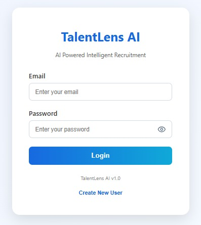
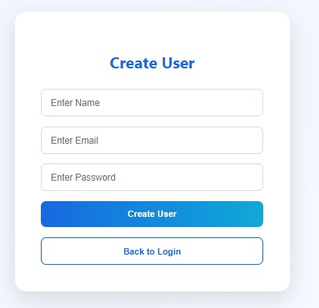
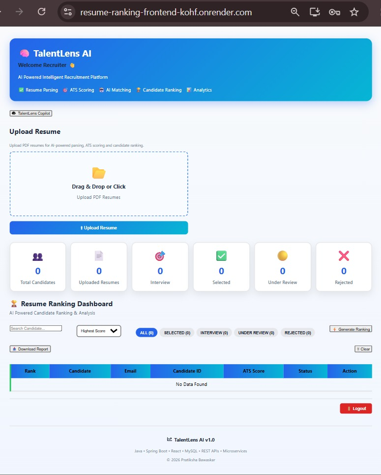
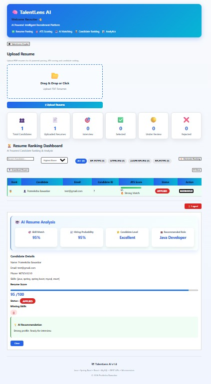
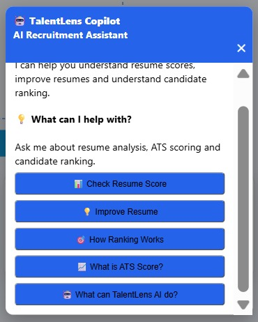

```markdown
# TalentLens AI  
### Recruiter-Focused Resume Analysis and Candidate Ranking Platform

---

## 📖 Project Overview
TalentLens AI is a recruiter-focused resume analysis and candidate ranking platform built using **React** and **Spring Boot Microservices**.  
It enables recruiters to create users, authenticate via JWT, upload resumes, extract text, analyze resumes, calculate ATS-style scores, rank candidates, and manage candidate information in a centralized dashboard.

---

## 🚀 Live Demo
[TalentLens AI Application](https://resume-ranking-frontend-kohf.onrender.com)

---

## 📂 GitHub Repository
[Smart AI Resume Analyzer](https://github.com/pratiksha-bawaskar/smart-ai-resume-analyzer)

---

## ✨ Features
- JWT authentication  
- User creation & login  
- Persistent user session  
- PDF resume upload  
- Resume text extraction using Apache PDFBox  
- Resume analysis  
- ATS-style scoring  
- Candidate ranking  
- Candidate search & filtering  
- Candidate details view  
- Candidate status management  
- Report download  
- API Gateway routing  
- Eureka service discovery  
- MySQL persistence  
- Render deployment  
- TalentLens Copilot UI  

---

## 🛠 Technology Stack

**Frontend**
- React.js  
- JavaScript  
- Axios  
- CSS  
- Framer Motion  
- React Icons  

**Backend**
- Java  
- Spring Boot  
- Spring Boot Microservices  
- Spring Cloud Eureka  
- Spring Cloud API Gateway  
- REST APIs  
- JWT Authentication  

**Database**
- MySQL  

**Resume Processing**
- Apache PDFBox  

**Deployment**
- Render  

---

## 🏗 System Architecture
```text
                    React Frontend
                          ↓
                     API Gateway
                          ↓
          ┌───────────────┼───────────────┐
          ↓               ↓               ↓
     User Service    Resume Service   Ranking Service
          │               │               │
          └───────────────┼───────────────┘
                          ↓
                    MySQL Database

                    Eureka Server
              (Service Registration /
                 Service Discovery)

```

## 🔄 Application Flow

Recruiter Login  
        ↓  
Upload Resume  
        ↓  
Resume Service  
        ↓  
PDF Text Extraction  
        ↓  
Resume Analysis  
        ↓  
ATS-style Score  
        ↓  
Candidate Ranking  
        ↓  
Candidate Details  
        ↓  
Recruiter Status Update  

---

## 🖼 Application Screenshots
  
  
  
  
  

---

## 📊 Candidate Analysis
- Resumes are uploaded in PDF format.  
- Apache PDFBox extracts text.  
- Rule/keyword-based ATS-style scoring is applied.  
- Candidates are ranked based on scores.  
- Recruiters can filter, search, and update candidate statuses.  

---

## ⚙️ Microservice Responsibilities

**User Service**
- User registration  
- User login  
- JWT generation  
- User management  

**Resume Service**
- Resume upload  
- PDF text extraction  
- Resume analysis  
- Score calculation  
- Candidate information  
- Candidate status management  

**Ranking Service**
- Candidate ranking  
- Ranking reports  
- Candidate ordering based on score  

**API Gateway**
- Centralized backend entry point  
- Request routing to microservices  

**Eureka**
- Service registration  
- Service discovery  
- Dynamic service communication  

---

## 🔐 Authentication
- JWT-based authentication  
- Secure login flow  
- Persistent user sessions stored in localStorage  

---

## 📄 Resume Processing
- PDF resumes uploaded via frontend  
- Apache PDFBox extracts text  
- Rule-based ATS scoring applied  
- Candidate details stored in MySQL  

---

## 📈 Ranking
- Candidates ranked based on ATS-style scores  
- Ranking Service provides ordered candidate lists  
- Recruiters can view ranking reports  

---

## 🧪 Testing
The application has been tested using:  
- Local development environment  
- REST API testing  
- Postman  
- Browser testing  
- Cloud/deployment testing  

---

## ☁️ Deployment
Deployed on **Render** with the following components:  
- React frontend  
- API Gateway  
- User Service  
- Resume Service  
- Ranking Service  
- Eureka Discovery Server  

---

## 🔮 Future Enhancements
- Job Description based resume matching  
- Job-specific candidate scoring  
- Automatic candidate email notifications  
- Advanced AI/ML-based resume analysis  
- Recruiter analytics and hiring insights  
- Role-based access control  

---

## 👩‍💻 Author
**Pratiksha Bawaskar**  
Java Full Stack Developer | Spring Boot | React | Microservices
```
